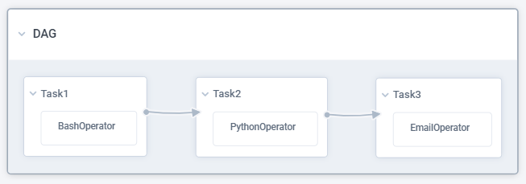

# CSII Data & Digital Dept. Airflow Data Pipelines
Data pipelines for CSII business intelligence dashboards on Power BI.  
Pipelines are run and managed by on-premise Airflow server.

* Airflow UI: http://10.212.47.162:8080/

## Airflow overview

* __DAG__ -- a data pipeline. (Direct Acyclic Graph)
* __DAG Run__ -- one exectuion of DAG.
* __Task__ -- an unit of work in a pipeline, done by Operator.
    * Example: "Send email", "Move data from A to B"
* __Task Instance__ -- one execution of Task.
* __Operator__ -- module that performs specific job.
    * Example: PythonOperator -- runs Python function.

> This project currently uses only `PythonOperator` with custom functions written in `common/functions.py` or inside DAGs.

Folder structure:
* `dags/` -- DAG definitons
* `dags/commmon/` -- custom common Python elements
* `dags/plugins` -- custom Airflow plugins
* `sql/` -- SQL queries used in DAGs
* `sql/ddl/` -- misc. SQL/ML queries for working with tables

> **NOTE**:  
> Airflow uses UTC (GMT+0) time for all datetimes.  
> Use timezones to pass JST times.

### How to create DAG

See: [DAG_tutorial.md](DAG_tutorial.md)

**IMPORTANT**:
* `dag_id` should be in format `filename_version`. Version is date in `YYYYMMDD` format based on the day the dag was finalized and submitted for PR.
    * Version example: `v20201201` (December 1st, 2020)
    * Full `dag_id` example: `master_material_hana_to_ch_v20201201`
* Version in `dag_id` **MUST** be changed when **any** modification of the DAG is done.
    * After pushing new DAG to Airflow, the previous DAG **MUST** be turned OFF and new DAG must be turned ON.
* `start_date` must also be readjusted.

## Common functions
> All functions support **ONLY** keyword arguments!

See `common/functions.py` for detailed documentation.  
Currently available functions:

**Processing**:
* `hana_to_ch(*, hana_conn_id, hana_sql_file, ch_conn_id, ch_target_table, transform_func=None, truncate=False, max_fetch_rows=100_000, **context)`

**Utility**:
* `send_job_success(**context)`

## Common abbreviations and terminology

Projects:
* __ar__ -- AR Tracker
* __dbp__ -- Daily Business Pulse
* __intage__ -- Intage Market Intelligence
* __trax__ -- Trax Insights
* __m365__ -- Microsoft 365 User Analytics

Technology:
* __ch__ -- ClickHouse database  
* __hana__ -- SAP HANA database
* __ml__ -- MarkLogic
* __mlcp__ -- MarkLogic Content Pump command-line tool (`mlcp.sh`)
* __tde__ -- Template Driven Extraction (SQL view definition in MarkLogic)

## Development recommendations
* Use `dag_template.py` file as a template for creating new DAG.
* Files with `draft_` prefix are set to be ignored by git. Use the prefix to store your sql/command/script draft files only locally.
* Source and destination tables should match whenever possible. Shortening the name is acceptable if source name is too long.
* DAG IDs, Task IDs, file names, table names and paths should be lowercase, words split by underscore `_` . Example: `master_customer_hana_to_ch.py`.

## Pipelines
| DAG Name | Source | Destination | Schedule |
|:---|:---:|:---:|---:|
| master_customer_hana_to_ch | SAP HANA `"_SYS_BIC"."system-local.bw.bw2hana/ZJCUST"` | ClickHouse `commercial.zjcust` | Daily 07:15 JST |
| master_material_hana_to_ch | SAP HANA `"_SYS_BIC"."system-local.bw.bw2hana/ZJMATE"` | ClickHouse `commercial.zjmate` | Daily 07:15 JST |
